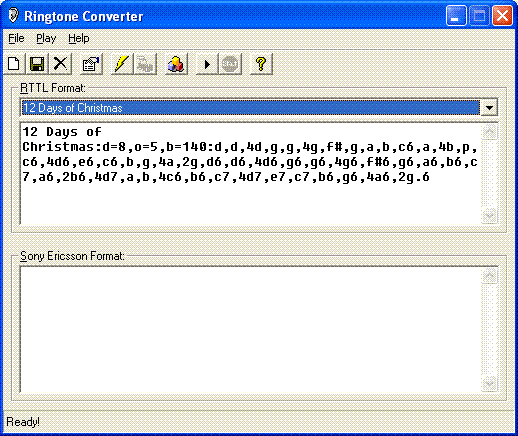



## Ringtone Converter

### Description

Converts RTTTL ringtone data to the iMelody format for supported mobile phones.
 
### More Info
 
Compiles with VB5/6. Needs VB runtime.

             |
---                |---
**Submitted On**   |2005-08-17 19:26:20
**By**             |[Samuel Gomes](https://github.com/Planet-Source-Code/PSCIndex/blob/master/ByAuthor/samuel-gomes.md)
**Level**          |Intermediate
**User Rating**    |5.0 (10 globes from 2 users)
**Compatibility**  |VB 6\.0
**Category**       |[Sound/MP3](https://github.com/Planet-Source-Code/PSCIndex/blob/master/ByCategory/sound-mp3__1-45.md)
**World**          |[Visual Basic](https://github.com/Planet-Source-Code/PSCIndex/blob/master/ByWorld/visual-basic.md)
**Archive File**   |[Ringtone\_C1927288252005\.zip](https://github.com/Planet-Source-Code/samuel-gomes-ringtone-converter__1-62320/archive/master.zip)

